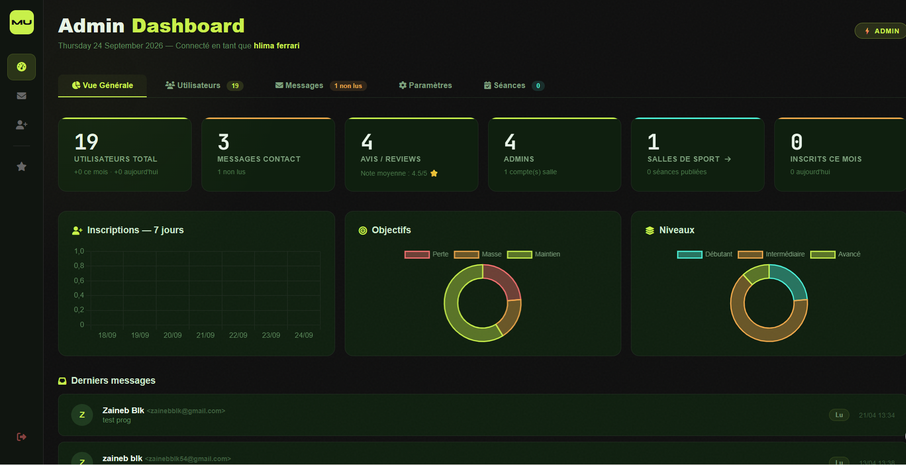
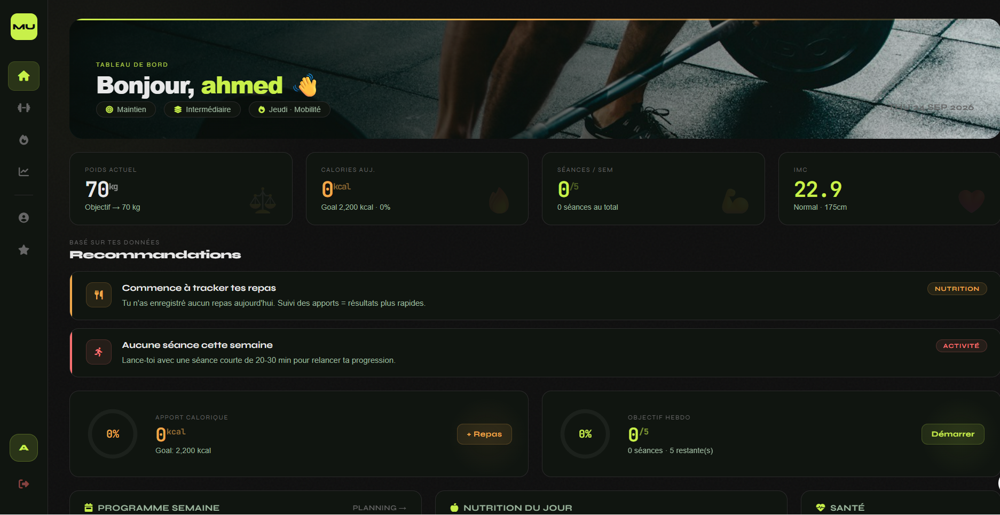
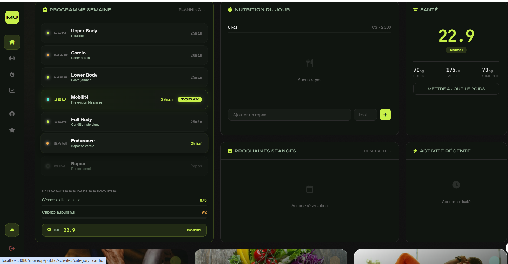
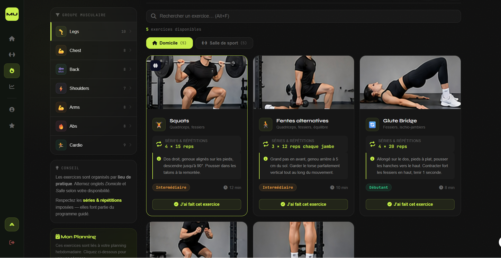
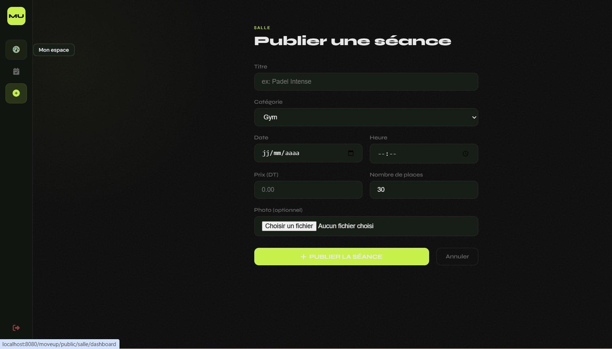
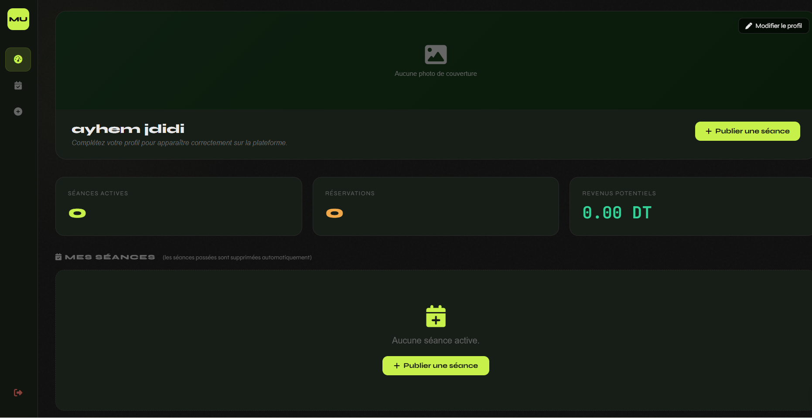
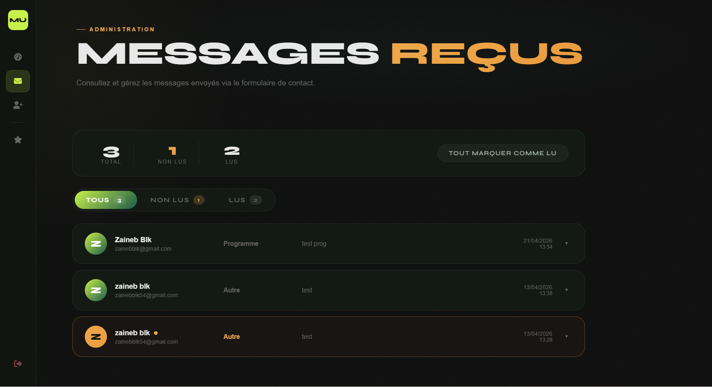
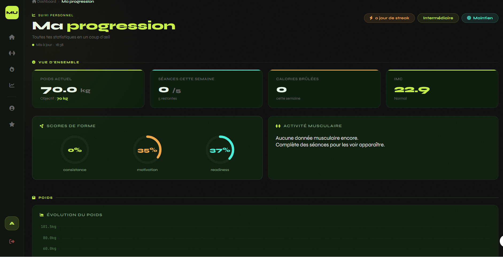
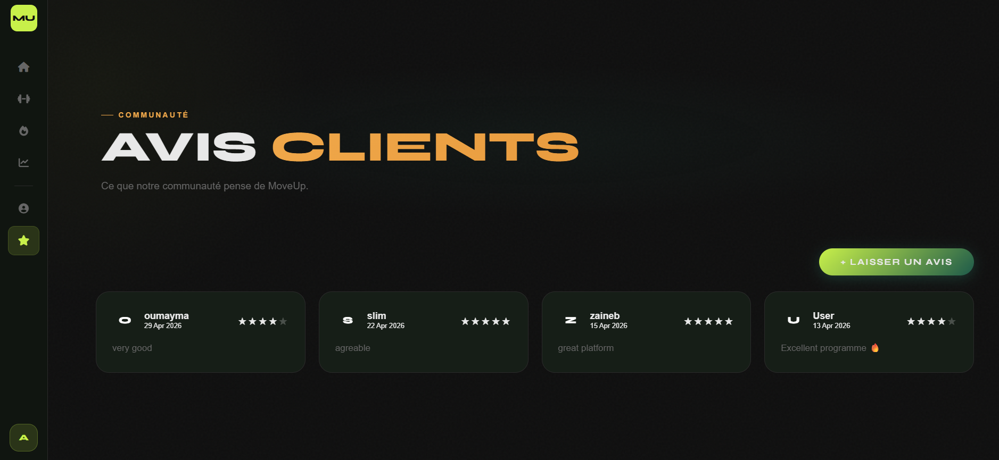

# MoveUp

A fitness tracking web app (PHP MVC + MySQL) for users, gym admins, and platform super-admins — covering workouts, progression, weight, nutrition, water tracking, courses, and gym-owner dashboards.

## ✨ Features

- **User dashboard**: workout logging, progression charts, weight & nutrition tracking, water intake
- **Gym Admin dashboard**: manage gym courses, view enrolled users
- **Super Admin dashboard**: platform-wide user management, messages, reviews, and analytics
- Contact & messaging system between users and admins
- Reviews and ratings
- Password-reset via email

## 🛠 Tech Stack

PHP 8+ (custom MVC architecture) · MySQL/MariaDB · Vanilla JS · Chart.js · HTML/CSS

## 📸 Screenshots

### Admin Dashboard

### User Dashboard

### Exercises

### Gym - Add

### Gym Dashboard

### Admin Messages

### User Progression

### Reviews

## Requirements

- PHP 8+ and MySQL/MariaDB (XAMPP works)

## Setup

1. Put the project in your web root (e.g. `htdocs/moveup28`).
2. Create a MySQL database named `moveup` and import `schema.sql` (phpMyAdmin → Importer).
3. Check `config/database.php` (defaults: user `root`, empty password).
4. Point Apache at the `public/` folder (or open `http://localhost/moveup/public`).
5. Optional, for password-reset emails: copy `config/mail.example.php` to `config/mail.php` and add your Gmail App Password.

## Structure

- `app/` — controllers, models, views, services
- `core/` — router, view, auth, database
- `public/` — entry point, CSS, JS, assets